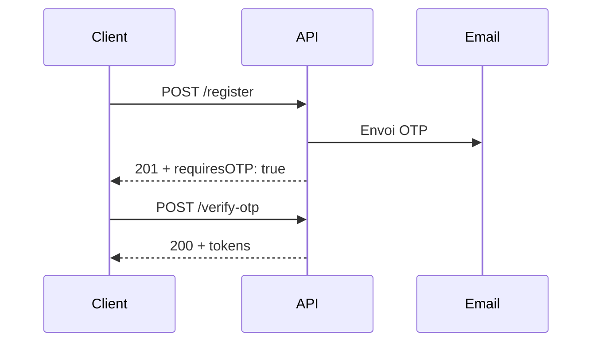

# 🔐 Auth API

Module d'authentification avec OTP et refresh tokens.

## Base URL
```
/api/auth
```

---

## Endpoints

### POST `/register` - Inscription
Crée un compte et envoie un code OTP par email.

**Body:**
```json
{
  "email": "marie@example.com",
  "password": "SecurePass123!",
  "firstName": "Marie",
  "lastName": "Dupont",
  "phone": "+237690000000",
  "role": "client"
}
```

**Réponse 201:**
```json
{
  "success": true,
  "message": "Inscription réussie. Vérifiez votre email.",
  "data": {
    "user": { "id": "...", "email": "...", "isEmailVerified": false },
    "requiresOTP": true
  }
}
```

---

### POST `/verify-otp` - Vérifier OTP
Vérifie le code reçu par email et active le compte.

**Body:**
```json
{
  "email": "marie@example.com",
  "otp": "123456"
}
```

**Réponse 200:**
```json
{
  "success": true,
  "data": {
    "user": { ... },
    "accessToken": "eyJ...",
    "refreshToken": "abc123..."
  }
}
```

**Erreurs:**
- `400` - OTP invalide ou expiré
- `400` - Trop de tentatives (max 3)

---

### POST `/resend-otp` - Renvoyer OTP
Envoie un nouveau code OTP.

**Rate Limit:** 3 /heure

**Body:**
```json
{ "email": "marie@example.com" }
```

---

### POST `/login` - Connexion
Connecte l'utilisateur.

**Rate Limit:** 5 tentatives / 15 min

**Body:**
```json
{
  "email": "marie@example.com",
  "password": "SecurePass123!"
}
```

**Réponse 200 (email vérifié):**
```json
{
  "success": true,
  "data": {
    "user": { ... },
    "provider": { ... },
    "accessToken": "eyJ...",
    "refreshToken": "abc..."
  }
}
```

**Réponse 200 (email non vérifié):**
```json
{
  "success": true,
  "data": {
    "requiresOTP": true,
    "email": "marie@example.com"
  }
}
```

**Erreurs:**
- `401` - Identifiants incorrects
- `423` - Compte verrouillé (5 échecs → 30 min)

---

### POST `/refresh-token` - Rafraîchir Token
Obtient un nouveau access token.

**Body:**
```json
{ "refreshToken": "abc123..." }
```

**Réponse 200:**
```json
{
  "success": true,
  "data": { "accessToken": "eyJ..." }
}
```

---

### POST `/logout` - Déconnexion
🔒 **Auth requise**

**Body (optionnel):**
```json
{ "refreshToken": "abc123..." }
```

---

### POST `/logout-all` - Déconnexion Globale
🔒 **Auth requise**

Révoque tous les refresh tokens de l'utilisateur.

---

### POST `/forgot-password` - Mot de passe oublié
Envoie un email de réinitialisation.

**Rate Limit:** 3 /heure

**Body:**
```json
{ "email": "marie@example.com" }
```

---

### POST `/reset-password/:token` - Réinitialiser
Définit un nouveau mot de passe.

**Params:** `token` - Token reçu par email

**Body:**
```json
{ "password": "NewSecurePass123!" }
```

---

### GET `/me` - Profil Connecté
🔒 **Auth requise**

Retourne le profil de l'utilisateur connecté.

---

## Flux d'Inscription



## Sécurité

| Protection | Valeur |
|------------|--------|
| Max tentatives login | 5 |
| Durée verrouillage | 30 min |
| Max tentatives OTP | 3 |
| Expiration OTP | 10 min |
| Access token | 15 min |
| Refresh token | 7 jours |
