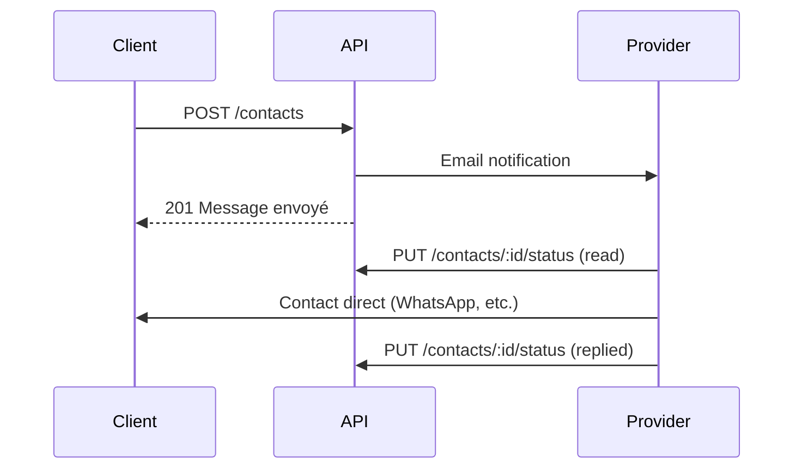

# 📧 Contacts API

Demandes de contact entre clients et prestataires.

## Base URL
```
/api/contacts
```

> 💡 **i18n**: Ajoutez `?lang=en` pour les messages en anglais. Voir [README](./README.md#-internationalisation-i18n).

---

## Endpoints

### POST `/` - Envoyer une Demande

Peut être utilisé avec ou sans authentification.

**Rate Limit:** 10 /heure

**Body:**
```json
{
  "providerId": "uuid",
  "message": "Bonjour, je souhaite prendre rendez-vous pour...",
  "senderName": "Jeanne Kamga",
  "senderEmail": "jeanne@example.com",
  "senderPhone": "+237690000000"
}
```

**Validation:**
| Champ | Règle |
|-------|-------|
| `message` | 10-2000 caractères |
| `senderName` | requis |
| `senderEmail` | email valide, requis |
| `senderPhone` | optionnel |

**Réponse 201:**
```json
{
  "success": true,
  "message": "Message envoyé avec succès"
}
```

> **Note:** Un email est envoyé au prestataire.

---

### GET `/received` - Demandes Reçues 🔒

⚠️ **Rôle requis:** `provider`

**Query Params:**
| Param | Type | Description |
|-------|------|-------------|
| `page` | int | Page |
| `limit` | int | Éléments/page |
| `status` | string | `pending`, `read`, `replied` |

**Réponse 200:**
```json
{
  "success": true,
  "data": {
    "contacts": [
      {
        "id": "uuid",
        "message": "Bonjour...",
        "senderName": "Jeanne Kamga",
        "senderEmail": "jeanne@example.com",
        "senderPhone": "+237690000000",
        "status": "pending",
        "createdAt": "2024-01-15T10:00:00Z",
        "sender": {
          "id": "uuid",
          "firstName": "Jeanne",
          "profilePhoto": "..."
        }
      }
    ],
    "pagination": { ... }
  }
}
```

---

### GET `/sent` - Demandes Envoyées 🔒

Liste des demandes envoyées par l'utilisateur connecté.

---

### PUT `/:id/status` - Mettre à Jour le Statut 🔒

⚠️ Seul le prestataire destinataire peut modifier.

**Body:**
```json
{
  "status": "read"
}
```

**Statuts:**
| Statut | Description |
|--------|-------------|
| `pending` | Non lu |
| `read` | Lu |
| `replied` | Répondu |

> **Note:** Un email est envoyé au client lorsque le statut passe à `read` ou `replied`.

---

### GET `/stats/daily` - Statistiques Journalières 🔒

⚠️ **Rôle requis:** `provider`

Retourne les contacts groupés par jour pour le dashboard prestataire.

**Query Params:**
| Param | Type | Description |
|-------|------|-------------|
| `startDate` | date | Date de début (défaut: -30 jours) |
| `endDate` | date | Date de fin (défaut: aujourd'hui) |

**Réponse 200:**
```json
{
  "success": true,
  "data": {
    "period": {
      "start": "2025-12-15",
      "end": "2026-01-15"
    },
    "totalContacts": 47,
    "dailyStats": [
      { "date": "2026-01-15", "count": 5 },
      { "date": "2026-01-14", "count": 3 },
      { "date": "2026-01-13", "count": 8 }
    ]
  }
}
```

---

### GET `/by-date/:date` - Contacts par Date 🔒

⚠️ **Rôle requis:** `provider`

Retourne la liste des contacts reçus un jour spécifique.

**Params:**
| Param | Type | Description |
|-------|------|-------------|
| `date` | string | Date au format YYYY-MM-DD |

**Query Params:**
| Param | Type | Description |
|-------|------|-------------|
| `page` | int | Page |
| `limit` | int | Éléments/page |

**Réponse 200:**
```json
{
  "success": true,
  "data": {
    "date": "2026-01-15",
    "contacts": [
      {
        "id": "uuid",
        "senderName": "Marie Kamga",
        "senderEmail": "marie@example.com",
        "message": "Bonjour...",
        "status": "pending",
        "createdAt": "2026-01-15T10:30:00Z"
      }
    ],
    "pagination": { ... }
  }
}
```

---

## Workflow



## 🔄 Workflow Détaillé

```
[Client] POST /api/contacts
{ providerId, message, senderName, senderEmail, senderPhone }
    │
    ▼
┌─────────────────────┐
│ RateLimit: 10/heure │ ── Dépassé ──▶ 429 Too Many Requests
└─────────┬───────────┘
          │
          ▼
┌─────────────────────┐
│ Provider existe ?   │ ── Non ──▶ 404 Not Found
└─────────┬───────────┘
          │ Oui
          ▼
┌─────────────────────┐
│ Validation:         │
│ - message 10-2000   │
│ - email valide      │
│ - senderName requis │
└─────────┬───────────┘
          │
          ▼
┌─────────────────────┐
│ Crée Contact        │
│ status = 'pending'  │
│ userId = req.user   │ (si authentifié)
└─────────┬───────────┘
          │
          ▼
┌─────────────────────┐
│ Provider.contacts++ │
│ (contactsCount)     │
└─────────┬───────────┘
          │
          ▼
┌─────────────────────┐
│ 📧 Email prestataire│
│ contact-notification│
└─────────────────────┘
          │
          ▼
     201 Created

═══════════════════════════════════════════════════════════

[Prestataire] GET /api/contacts/received
    │
    ▼
┌─────────────────────┐
│ Liste contacts      │
│ where providerId    │
│ Filtres: status     │
└─────────────────────┘
          │
          ▼
     200 OK { contacts[] }

═══════════════════════════════════════════════════════════

[Prestataire] PUT /api/contacts/:id/status { status: 'read' }
    │
    ▼
┌─────────────────────┐
│ Transitions:        │
│ pending → read      │
│ read → replied      │
└─────────────────────┘
          │
          ▼
     200 OK
```

