# 📧 Contacts API

Demandes de contact entre clients et prestataires.

## Base URL
```
/api/contacts
```

---

## Endpoints

### POST `/` - Envoyer une Demande

Peut être utilisé avec ou sans authentification.

**Rate Limit:** 10 /heure

**Body:**
```json
{
  "providerId": "uuid",
  "message": "Bonjour, je souhaite prendre rendez-vous pour...",
  "senderName": "Jeanne Kamga",
  "senderEmail": "jeanne@example.com",
  "senderPhone": "+237690000000"
}
```

**Validation:**
| Champ | Règle |
|-------|-------|
| `message` | 10-2000 caractères |
| `senderName` | requis |
| `senderEmail` | email valide, requis |
| `senderPhone` | optionnel |

**Réponse 201:**
```json
{
  "success": true,
  "message": "Message envoyé avec succès"
}
```

> **Note:** Un email est envoyé au prestataire.

---

### GET `/received` - Demandes Reçues 🔒

⚠️ **Rôle requis:** `provider`

**Query Params:**
| Param | Type | Description |
|-------|------|-------------|
| `page` | int | Page |
| `limit` | int | Éléments/page |
| `status` | string | `pending`, `read`, `replied` |

**Réponse 200:**
```json
{
  "success": true,
  "data": {
    "contacts": [
      {
        "id": "uuid",
        "message": "Bonjour...",
        "senderName": "Jeanne Kamga",
        "senderEmail": "jeanne@example.com",
        "senderPhone": "+237690000000",
        "status": "pending",
        "createdAt": "2024-01-15T10:00:00Z",
        "sender": {
          "id": "uuid",
          "firstName": "Jeanne",
          "profilePhoto": "..."
        }
      }
    ],
    "pagination": { ... }
  }
}
```

---

### GET `/sent` - Demandes Envoyées 🔒

Liste des demandes envoyées par l'utilisateur connecté.

---

### PUT `/:id/status` - Mettre à Jour le Statut 🔒

⚠️ Seul le prestataire destinataire peut modifier.

**Body:**
```json
{
  "status": "read"
}
```

**Statuts:**
| Statut | Description |
|--------|-------------|
| `pending` | Non lu |
| `read` | Lu |
| `replied` | Répondu |

---

## Workflow

```mermaid
sequenceDiagram
    Client->>API: POST /contacts
    API->>Provider: Email notification
    API-->>Client: 201 Message envoyé
    Provider->>API: PUT /contacts/:id/status (read)
    Provider->>Client: Contact direct (WhatsApp, etc.)
    Provider->>API: PUT /contacts/:id/status (replied)
```


